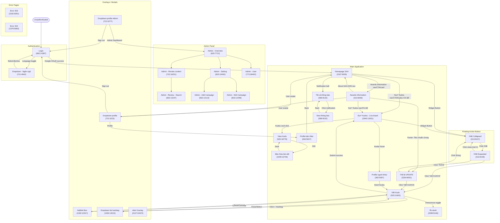
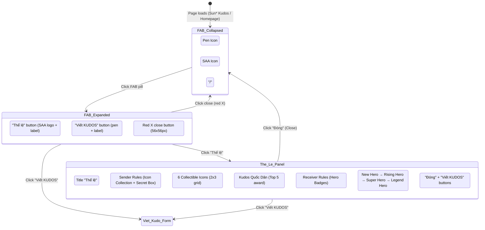
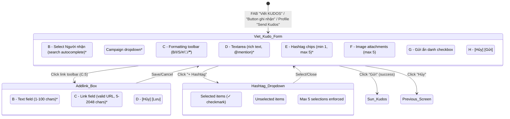

# Screen Flow Overview

## Project Info
- **Project Name**: Sun Annual Awards 2025 (SAA 2025)
- **Figma File Key**: 9ypp4enmFmdK3YAFJLIu6C
- **Figma URL**: https://www.figma.com/design/9ypp4enmFmdK3YAFJLIu6C
- **Created**: 2026-03-23
- **Last Updated**: 2026-03-31

---

## Discovery Progress

| Metric | Count |
|--------|-------|
| Total Screens | 32 |
| Discovered | 10 |
| Remaining | 22 |
| Completion | 31% |

---

## Screens

| # | Screen Name | Frame ID | Figma Link | Status | Detail File | Predicted APIs | Navigations To |
|---|-------------|----------|------------|--------|-------------|----------------|----------------|
| 1 | Login | 662:14387 | [Open](https://www.figma.com/design/9ypp4enmFmdK3YAFJLIu6C?node-id=662:14387) | discovered | — | POST /auth/google | Homepage SAA, Dropdown-ngôn ngữ |
| 2 | Homepage SAA | 2167:9026 | [Open](https://www.figma.com/design/9ypp4enmFmdK3YAFJLIu6C?node-id=2167:9026) | discovered | screen_specs/homepage_saa.md | GET /awards, GET /events/current | Awards Information, Sun* Kudos, Dropdown-profile, Notification Panel |
| 3 | Hệ thống giải thưởng (Awards Information) | 313:8436 | [Open](https://www.figma.com/design/9ypp4enmFmdK3YAFJLIu6C?node-id=313:8436) | discovered | [screen_specs/awards_information.md](screen_specs/awards_information.md) / [specs/313-8436-AwardInformation/](.momorph/specs/313-8436-AwardInformation/) | GET /awards | Homepage SAA (via header "Award Information" link), Sun* Kudos (via Kudos section CTA → /sun-kudos), Dropdown-profile, Tiêu chuẩn chung |
| 4 | Sun* Kudos - Live board | 2940:13431 | [Open](https://www.figma.com/design/9ypp4enmFmdK3YAFJLIu6C?node-id=2940:13431) | spec | [screen_specs/sun_kudos_live_board.md](screen_specs/sun_kudos_live_board.md) / [specs/2940-13431-SunKudosLiveBoard/](specs/2940-13431-SunKudosLiveBoard/) | GET /kudos/feed, GET /kudos/highlighted, GET /kudos/stats, GET /kudos/spotlight | Viết Kudo, View Kudo, Profile người khác, Homepage SAA, Awards Information, Dropdown-profile, Thể lệ |
| 5 | Viết Kudo | 520:11602 | [Open](https://www.figma.com/design/9ypp4enmFmdK3YAFJLIu6C?node-id=520:11602) | discovered | [screen_specs/viet_kudo.md](screen_specs/viet_kudo.md) | POST /kudos, GET /users/search, GET /campaigns/active, GET /hashtags | Sun* Kudos (submit), Addlink Box (link toolbar), Dropdown list hashtag (+ Hashtag), Ẩn danh (toggle) |
| 6 | View Kudo | 520:18779 | [Open](https://www.figma.com/design/9ypp4enmFmdK3YAFJLIu6C?node-id=520:18779) | pending | — | GET /kudos/:id | Sun* Kudos, Profile |
| 7 | Profile bản thân | 362:5037 | [Open](https://www.figma.com/design/9ypp4enmFmdK3YAFJLIu6C?node-id=362:5037) | pending | — | GET /users/me, GET /kudos?user= | Homepage SAA, Viết Kudo |
| 8 | Profile người khác | 362:5097 | [Open](https://www.figma.com/design/9ypp4enmFmdK3YAFJLIu6C?node-id=362:5097) | pending | — | GET /users/:id, GET /kudos?user= | Sun* Kudos, Viết Kudo |
| 9 | Tất cả thông báo | 589:9132 | [Open](https://www.figma.com/design/9ypp4enmFmdK3YAFJLIu6C?node-id=589:9132) | pending | — | GET /notifications | Homepage SAA, View thông báo |
| 10 | View thông báo | 589:9152 | [Open](https://www.figma.com/design/9ypp4enmFmdK3YAFJLIu6C?node-id=589:9152) | pending | — | GET /notifications/:id | Tất cả thông báo |
| 11 | Admin - Overview | 620:7712 | [Open](https://www.figma.com/design/9ypp4enmFmdK3YAFJLIu6C?node-id=620:7712) | pending | — | GET /admin/stats | Admin - Review content, Admin - Setting |
| 12 | Admin - Review content | 722:16251 | [Open](https://www.figma.com/design/9ypp4enmFmdK3YAFJLIu6C?node-id=722:16251) | pending | — | GET /admin/kudos, PUT /kudos/:id/status | Admin - Overview |
| 13 | Admin - Review content - Search | 832:13197 | [Open](https://www.figma.com/design/9ypp4enmFmdK3YAFJLIu6C?node-id=832:13197) | pending | — | GET /admin/kudos?search= | Admin - Review content |
| 14 | Admin - Setting | 820:10492 | [Open](https://www.figma.com/design/9ypp4enmFmdK3YAFJLIu6C?node-id=820:10492) | pending | — | GET /admin/campaigns | Admin - Overview, Admin - Setting - add Campaign |
| 15 | Admin - Setting - add Campaign | 832:12113 | [Open](https://www.figma.com/design/9ypp4enmFmdK3YAFJLIu6C?node-id=832:12113) | pending | — | POST /admin/campaigns | Admin - Setting |
| 16 | Admin - Setting - add new Campaign | 820:11445 | [Open](https://www.figma.com/design/9ypp4enmFmdK3YAFJLIu6C?node-id=820:11445) | pending | — | POST /admin/campaigns | Admin - Setting |
| 17 | Admin - Setting - Edit Campaign | 832:12299 | [Open](https://www.figma.com/design/9ypp4enmFmdK3YAFJLIu6C?node-id=832:12299) | pending | — | GET /admin/campaigns/:id, PUT /admin/campaigns/:id | Admin - Setting |
| 18 | Admin - User | 773:26403 | [Open](https://www.figma.com/design/9ypp4enmFmdK3YAFJLIu6C?node-id=773:26403) | pending | — | GET /admin/users, PUT /users/:id/role | Admin - Overview |
| 19 | Error page - 403 | 2182:9291 | [Open](https://www.figma.com/design/9ypp4enmFmdK3YAFJLIu6C?node-id=2182:9291) | pending | — | — | Homepage SAA |
| 20 | Error page - 404 | 1378:5063 | [Open](https://www.figma.com/design/9ypp4enmFmdK3YAFJLIu6C?node-id=1378:5063) | pending | — | — | Homepage SAA |
| 21 | Thể lệ UPDATE (Rules/T&C) | 3204:6051 | [Open](https://www.figma.com/design/9ypp4enmFmdK3YAFJLIu6C?node-id=3204:6051) | discovered | — | GET /rules | FAB Expanded (close), Viết Kudo (via "Viết KUDOS" button) |
| 22 | Ẩn danh | 2099:9148 | [Open](https://www.figma.com/design/9ypp4enmFmdK3YAFJLIu6C?node-id=2099:9148) | pending | — | POST /kudos (anonymous) | Sun* Kudos |
| 23 | Màn Sửa bài viết - edit mode | 1949:13746 | [Open](https://www.figma.com/design/9ypp4enmFmdK3YAFJLIu6C?node-id=1949:13746) | pending | — | GET /kudos/:id, PUT /kudos/:id | View Kudo, Sun* Kudos |
| 24 | Gửi lời chúc Kudos | 828:13433 | [Open](https://www.figma.com/design/9ypp4enmFmdK3YAFJLIu6C?node-id=828:13433) | pending | — | POST /kudos | Sun* Kudos |
| 25 | Dropdown-profile | 721:5223 | [Open](https://www.figma.com/design/9ypp4enmFmdK3YAFJLIu6C?node-id=721:5223) | pending | — | POST /auth/logout | Homepage SAA, Profile, Login |
| 26 | Dropdown-profile Admin | 721:5277 | [Open](https://www.figma.com/design/9ypp4enmFmdK3YAFJLIu6C?node-id=721:5277) | pending | — | POST /auth/logout | Admin - Overview, Profile, Login |
| 27 | Dropdown-ngôn ngữ | 721:4942 | [Open](https://www.figma.com/design/9ypp4enmFmdK3YAFJLIu6C?node-id=721:4942) | pending | — | — | (same screen, locale change) |
| 28 | Alert Overlay | 3127:24672 | [Open](https://www.figma.com/design/9ypp4enmFmdK3YAFJLIu6C?node-id=3127:24672) | pending | — | — | (same screen, confirmation) |
| 29 | FAB - Collapsed (Widget Button) | 313:9137 | [Open](https://www.figma.com/design/9ypp4enmFmdK3YAFJLIu6C?node-id=313:9137) | discovered | — | — | FAB Expanded |
| 30 | FAB - Expanded (Widget Button) | 313:9139 | [Open](https://www.figma.com/design/9ypp4enmFmdK3YAFJLIu6C?node-id=313:9139) | discovered | — | — | Thể lệ UPDATE, Viết Kudo, FAB Collapsed |
| 31 | Addlink Box | 1002:12917 | [Open](https://www.figma.com/design/9ypp4enmFmdK3YAFJLIu6C?node-id=1002:12917) | discovered | [screen_specs/addlink_box.md](screen_specs/addlink_box.md) | — | Viết Kudo (save/cancel) |
| 32 | Dropdown list hashtag | 1002:13013 | [Open](https://www.figma.com/design/9ypp4enmFmdK3YAFJLIu6C?node-id=1002:13013) | discovered | [screen_specs/dropdown_list_hashtag.md](screen_specs/dropdown_list_hashtag.md) | GET /hashtags | Viết Kudo (close/select) |

---

## Navigation Graph

---

## FAB + Thể lệ User Journey

## Viết Kudo User Journey

---

## Screen Details (Discovered)

### 1. Login (Frame ID: 662:14387)

**Purpose**: Entry point of the SAA 2025 application. Authenticates users via Google OAuth before granting access to the main application.

#### Entry Points
- App launch (unauthenticated users are redirected here)
- Session expiry / logout

#### Exit Points
- Successful Google login → Homepage SAA
- Language dropdown → Dropdown overlay (Dropdown-ngôn ngữ, Frame 721:4942)

#### Key UI Elements

| No | Component | Type | Description |
|----|-----------|------|-------------|
| A | A_Header | Navigation | Top bar: SAA 2025 logo (non-interactive) + language toggle (top-right) |
| A.1 | A.1_Logo | Logo | "Sun Annual Awards 2025" logo — non-interactive |
| A.2 | A.2_Language | Toggle Button | Current language "VN" with flag. Click opens Dropdown-ngôn ngữ |
| B | B_Bìa | Hero Frame | Full-width hero with key visual, headline, subtitle, and login CTA |
| B.1 | B.1_Key Visual | Hero Banner | Decorative "ROOT FURTHER" background artwork |
| B.2 | B.2_content | Info Block | "Bắt đầu hành trình của bạn cùng SAA 2025." + "Đăng nhập để khám phá!" |
| B.3 | B.3_Login | CTA Button | "LOGIN With Google" → Google OAuth. Loading state on click |
| D | D_Footer | Footer Label | "Bản quyền thuộc về Sun* © 2025" — non-interactive |

---

### 2. Homepage SAA (Frame ID: 2167:9026)

**Purpose**: Main landing page for authenticated users. Introduces SAA 2025 ("ROOT FURTHER"), shows a real-time countdown, presents the 6-award system grid, and promotes Sun* Kudos.

#### Entry Points
- Successful Google login
- Header/footer logo click from any screen

#### Key UI Elements

| No | Component | Type | Description |
|----|-----------|------|-------------|
| A1 | A1_Header | Organism | Sticky header: logo + nav links + notification bell + language + avatar |
| B | Bìa (Hero) | Organism | "ROOT FURTHER" key visual + countdown + event info + CTA buttons |
| B1 | B1_Countdown | Molecule | Real-time DAYS/HOURS/MINUTES countdown. Updates per minute |
| B2 | B2_EventInfo | Molecule | Event time (18h30), venue, Facebook live note |
| B3 | B3_CTA | Molecule | "ABOUT AWARDS" + "ABOUT KUDOS" buttons |
| B4 | B4_content | Molecule | "ROOT FURTHER" descriptive paragraph |
| C1 | C1_Header | Molecule | Section heading for awards system |
| C2 | C2_Award list | Organism | 6 award cards (2-col mobile, 3-col desktop) — each links to `/awards-information#{slug}` |
| D1 | D1_Sunkudos | Organism | Sun* Kudos promo: label + title + desc + "Chi tiết" CTA |
| 6 | Widget Button | FAB | Fixed gold pill (bottom-right): pen icon + SAA logo. Toggles quick-action menu |
| 7 | Footer | Organism | Logo + nav links + copyright |

---

### 4. Sun* Kudos - Live board (Frame ID: 2940:13431)

**Purpose**: Main hub for the peer-recognition feature. Serves as an interactive Kudos feed (users send/browse Kudos) and a real-time live board (spotlight, live counter, ticker). Split into 4 zones: Hero/Action area, Spotlight Board, All Kudos feed, Right stats sidebar.

#### Entry Points
- Homepage SAA: "Sun* Kudos" header nav, D1_Sunkudos "Chi tiết" button
- Awards Information: "Sun* Kudos" header nav, D1_Sunkudos "Chi tiết"
- Any footer: "Sun* Kudos" link
- After submitting a Kudo (Viết Kudo → back here)

#### Key UI Elements

| No | Component | Type | Description |
|----|-----------|------|-------------|
| Header | Header | Organism | Shared sticky header; "Sun* Kudos" nav item ACTIVE |
| Keyvisual | Keyvisual | Organism | Sun* Kudos hero background |
| A.1 | Button ghi nhận | CTA Button | Primary action: write/send a Kudo → /write-kudo |
| A.2 | Tìm kiếm sunner | Search | Search for Sunner — opens search overlay/filter |
| B_Highlight | B_Highlight | Organism | Highlighted Kudos carousel (prev/next/page navigation) |
| B.6 | Header Spotlight | Heading | "Sun* Annual Awards 2025 \| SPOTLIGHT BOARD" |
| B.7 | B.7_Spotlight | Organism | Live board: Kudos counter (388), avatar grid (pan/zoom), live ticker |
| C.1 | ALL KUDOS header | Heading | Section heading for full feed |
| C.2 | Kudos feed | Feed | Scrollable list of all Kudo posts (C.3–C.7 card instances) |
| D.1 | Thống kê tổng quát | Stats | General Kudos statistics |
| D.3 | Top 10 Sunner | Leaderboard | Top 10 Sunners who received the most Kudos |
| Footer | Footer | Organism | Shared footer with 4 nav links |

**Real-time Features**:
- Live Kudos counter (B.7.1): updates when new Kudo submitted
- Live ticker (B.7): "HH:MM [user] đã nhận được một Kudos mới"
- Live feed (C.2): new Kudos appear at top

---

### 5. FAB - Collapsed / Widget Button (Frame ID: 313:9137)

**Purpose**: Persistent floating action button (FAB) shown in the bottom-right corner of Kudos-related screens. Provides quick access to "Thể lệ" (Rules) and "Viết KUDOS" (Write KUDOS) actions. This is the collapsed/idle state.

#### Entry Points
- Default state on Sun* Kudos Live board and other Kudos screens
- Closing the expanded FAB (Frame 313:9139) via red X button
- Closing the "Thể lệ" panel (Frame 3204:6051) via "Đóng" button

#### Exit Points
- Click FAB pill -> FAB Expanded (313:9139)

#### Key UI Elements

| No | Component | Type | Description |
|----|-----------|------|-------------|
| A | A_Widget Button | FAB (Instance) | Gold pill-shaped button (41x32px), positioned bottom-right. Contains pen icon + "/" + lightning/SAA icon on yellow background |
| A.1 | A.1_icon viet kudos | Icon | Pen icon (left side) representing "Write KUDOS" |
| A.2 | A.2_icon the le saa | Icon | SAA logo icon (right side) representing "Thể lệ" (Rules) |

**Behavior**:
- Click: Expands to show two action options (-> Frame 313:9139)
- Hover: Light shadow effect
- Position: Fixed bottom-right, floats above page content
- Always visible while scrolling

---

### 6. FAB - Expanded / Widget Button Expanded (Frame ID: 313:9139)

**Purpose**: Expanded state of the floating action button, revealing two quick-action options: view rules ("Thể lệ") and write a kudos ("Viết KUDOS"), plus a close button to collapse back.

#### Entry Points
- Click on FAB Collapsed (313:9137)

#### Exit Points
- Click "Thể lệ" button -> Thể lệ UPDATE panel (3204:6051)
- Click "Viết KUDOS" button -> Viết Kudo form (520:11602)
- Click close (red X) button -> FAB Collapsed (313:9137)

#### Key UI Elements

| No | Component | Type | Description |
|----|-----------|------|-------------|
| A | A_Button the le | Button (Instance) | "Thể lệ" option: SAA logo icon + label "Thể lệ". 149x64px, light yellow background, rounded corners |
| B | B_Button viet kudos | Button (Instance) | "Viết KUDOS" option: Pen icon + label "Viết KUDOS". Same style as A |
| C | C_Button huy | Button (Instance) | Close/cancel button: 56x56px red circle with white "X" icon, with shadow |

**Behavior**:
- "Thể lệ" click: Opens rules panel/modal (-> Frame 3204:6051)
- "Viết KUDOS" click: Opens Kudos writing form (-> Frame 520:11602)
- Close (red X) click: Collapses back to idle FAB state (-> Frame 313:9137)
- Hover on A/B: Slight shadow increase and brightness change
- Position: Same bottom-right area as collapsed state, options stack vertically above close button

---

### 7. Thể lệ UPDATE / Rules Panel (Frame ID: 3204:6051)

**Purpose**: Modal/panel displaying the full rules and terms of the Sun* Kudos program within SAA 2025. Explains the Hero badge system for Kudos recipients, the icon collection game for Kudos senders, and the "Kudos Quốc Dân" (National Kudos) award.

#### Entry Points
- FAB Expanded (313:9139): Click "Thể lệ" button
- Footer link "Tiêu chuẩn chung" from Awards Information or other screens

#### Exit Points
- Click "Đóng" (Close) button -> Closes panel, returns to previous state
- Click "Viết KUDOS" button -> Opens Viết Kudo form (520:11602)

#### Key UI Elements

| No | Component | Type | Description |
|----|-----------|------|-------------|
| A | A_Noi dung the le | Info Block | Main content panel containing all rules content. Scrollable when content exceeds viewport |
| A.title | Title | Text | "Thể lệ" heading |
| A.sender | Nguoi gui section | Section | **SENDER rules**: "Sưu tập trọn bộ 6 icon, nhận ngay phần quà bí ẩn" -- every 5 heart reactions unlocks 1 Secret Box with chance to collect 1 of 6 exclusive SAA icons |
| A.sender.badges | Danh sach huy hieu | Grid | 6 collectible icon badges displayed in 2 rows of 3: REVIVAL, STAY GOLD, TOUCH OF LIGHT, FLOW TO HORIZON, BEYOND THE BOUNDARY, ROOT FURTHER |
| A.sender.reward | Reward text | Text | Collecting all 6 icons earns a mystery gift from SAA 2025 |
| A.sender.quocdn | KUDOS Quoc Dan | Text | Top 5 Kudos with most hearts become "Kudos Quốc Dân" and receive a special prize |
| A.receiver | Nguoi nhan section | Section | **RECEIVER rules**: "Huy hiệu Hero cho những ảnh hưởng tích cực" -- Hero badges based on number of unique Kudos senders |
| A.receiver.new | New Hero | Badge Card | 1-4 senders -> New Hero badge. "Hành trình lan tỏa điều tốt đẹp bắt đầu" |
| A.receiver.rising | Rising Hero | Badge Card | 5-9 senders -> Rising Hero badge. "Hình ảnh bạn đang lớn dần trong trái tim đồng đội" |
| A.receiver.super | Super Hero | Badge Card | 10-20 senders -> Super Hero badge. "Bạn đã trở thành biểu tượng được tin tưởng và yêu quý" |
| A.receiver.legend | Legend Hero | Badge Card | 20+ senders -> Legend Hero badge. "Bạn đã trở thành huyền thoại" |
| B | B_Button | Footer Actions | Action button row at bottom of panel |
| B.1 | B.1_Button dong | Button (Instance) | "Đóng" (Close): icon X + text, secondary/outlined style. Closes the panel |
| B.2 | B.2_Button viet kudos | Button (Instance) | "Viết KUDOS": pen icon + text, primary style (yellow). Opens Viết Kudo form (-> 520:11602) |

**Rules Content Summary**:

| Rule Category | Condition | Reward |
|---------------|-----------|--------|
| Sender: Icon Collection | Every 5 heart reactions on sent Kudos | 1 Secret Box (chance for 1 of 6 icons) |
| Sender: Full Collection | Collect all 6 icons | Mystery gift from SAA 2025 |
| Sender: Kudos Quốc Dân | Top 5 Kudos with most hearts | Special prize from SAA 2025 |
| Receiver: New Hero | 1-4 unique senders | New Hero badge on profile |
| Receiver: Rising Hero | 5-9 unique senders | Rising Hero badge on profile |
| Receiver: Super Hero | 10-20 unique senders | Super Hero badge on profile |
| Receiver: Legend Hero | 20+ unique senders | Legend Hero badge on profile |

**Behavior**:
- Panel is scrollable when content exceeds viewport
- "Đóng" closes the panel and returns to the underlying screen
- "Viết KUDOS" navigates to the Kudos writing form
- Buttons have hover state (color/shadow change) and disabled state (dimmed, non-clickable)

---

### 8. Viết Kudo (Frame ID: 520:11602)

**Purpose**: Modal/overlay form for composing and sending a Kudos message to a colleague. Provides a rich-text editor with formatting toolbar, recipient search, hashtag tagging, image attachments, and an anonymous sending option.

#### Entry Points
- FAB Expanded (313:9139): Click "Viết KUDOS" button
- Thể lệ UPDATE (3204:6051): Click "Viết KUDOS" button
- Sun* Kudos Live board (2940:13431): Click "Button ghi nhận" CTA
- Profile người khác (362:5097): Click "Send Kudos"

#### Exit Points
- Submit success ("Gửi") -> Sun* Kudos Live board (2940:13431)
- Cancel ("Hủy") -> Close modal, return to previous screen
- Link toolbar -> Addlink Box (1002:12917)
- "+ Hashtag" -> Dropdown list hashtag (1002:13013)

#### Key UI Elements

| No | Component | Type | Description |
|----|-----------|------|-------------|
| A | A_Title | Text | "Gửi lời cám ơn và ghi nhận đến đồng đội" heading |
| B | B_Chọn người nhận | Molecule | Recipient search with autocomplete dropdown. Required field (*) |
| B.2 | B.2_Search | Input | Search input with dropdown icon, placeholder "Tìm kiếm" |
| — | Campaign dropdown | Molecule | Campaign selection. Required field (*) |
| C | C_Chức năng | Toolbar | Rich text formatting: Bold (B), Italic (I), Strikethrough (S), Number list, Link, Quote + word counter |
| D | D_text filed | Textarea | Rich text area with placeholder and @mention support |
| D.1 | D.1_Gợi ý | Hint | 'Bạn có thể "@ + tên" để nhắc tới đồng nghiệp khác' |
| E | E_Hashtag | Tag Group | Hashtag selection. Required (*), max 5. "+ Hashtag" opens dropdown |
| F | F_Image | Upload | Image attachments. Optional, max 5. Thumbnails with X to remove |
| G | G_Gửi ẩn danh | Checkbox | "Gửi lời cám ơn và ghi nhận ẩn danh" toggle |
| H.1 | H.1_Button | Button | "Hủy" (Cancel) — secondary, icon X |
| H.2 | H.2_Button | Button | "Gửi" (Submit) — primary yellow, icon send. Disabled until all required fields filled |

#### Form Validation

| Field | Required | Rules |
|-------|----------|-------|
| Người nhận | Yes | Must select from autocomplete |
| Campaign | Yes | Must select from dropdown |
| Content | Yes | Min 1 character |
| Hashtag | Yes | Min 1, max 5 |
| Image | No | Max 5 images |
| Ẩn danh | No | Boolean toggle |

---

### 9. Addlink Box (Frame ID: 1002:12917)

**Purpose**: Sub-modal dialog for inserting a hyperlink into the rich-text editor. Two fields: "Text" (display text, 1-100 chars) and "Link" (URL, valid http/https, 5-2048 chars).

#### Entry Points
- Viết Kudo (520:11602): Click C.5_link toolbar button

#### Exit Points
- "Lưu" (Save) -> Insert link into editor, close modal
- "Hủy" (Cancel) -> Close modal, discard

#### Key UI Elements

| No | Component | Type | Description |
|----|-----------|------|-------------|
| A | A_Title | Text | "Add link" heading |
| B | B_Text | Input Field | "Text" label + text input (672x56px). Required, 1-100 chars |
| C | C_Link | Input Field | "Link" label + URL input with link icon (672x56px). Required, valid URL, 5-2048 chars |
| D.1 | D.1_Button Hủy | Button | "Hủy" — secondary with X icon |
| D.2 | D.2_Button Lưu | Button | "Lưu" — primary yellow with link icon |

---

### 10. Dropdown list hashtag (Frame ID: 1002:13013)

**Purpose**: Dropdown overlay for multi-selecting hashtags (max 5) when writing a Kudo. Shows predefined list with toggle selection (checkmark for selected). 13 available hashtags.

#### Entry Points
- Viết Kudo (520:11602): Click "+ Hashtag" button in E.2_Tag Group

#### Exit Points
- Click outside / dismiss -> Close dropdown, return to Viết Kudo

#### Key UI Elements

| No | Component | Type | Description |
|----|-----------|------|-------------|
| Trigger | + Hashtag button | Button | Opens the dropdown. Shows plus icon + text |
| A | A_Hashtag đã chọn | List Item | Selected hashtag row: "#tag" + checkmark icon (24x24px) |
| D | D_Hashtag chưa chọn | List Item | Unselected hashtag row: "#tag" without checkmark |
| A.2 | A.2_icon đã chọn | Icon | Circle checkmark indicating selected state |

**Available Hashtags**: Toàn diện, Giỏi chuyên môn, Hiệu suất cao, Truyền cảm hứng, Cống hiến, Aim High, Be Agile, Wasshoi, Hướng mục tiêu, Hướng khách hàng, Chuẩn quy trình, Giải pháp sáng tạo, Quản lý xuất sắc

**Behavior**:
- Toggle: Click toggles selection (checkmark appears/disappears)
- Max limit: At 5 selections, unselected items become disabled
- Hover: Row background changes on hover

---

### 3. Hệ thống giải thưởng / Awards Information (Frame ID: 313:8436)

- **Frame Name**: Hệ thống giải thưởng
- **File Key**: 9ypp4enmFmdK3YAFJLIu6C
- **Route**: `/awards-information`
- **Spec Directory**: `.momorph/specs/313-8436-AwardInformation/`

**Purpose**: Giới thiệu 6 hạng mục giải thưởng SAA 2025 với tiêu chí, số lượng, giá trị tiền thưởng. Dedicated page displaying all 6 SAA 2025 award categories with full details (description, recipient count, prize value). Left sticky nav for in-page navigation.

#### Entry Points
- Homepage SAA: "Awards Information" header nav, "ABOUT AWARDS" CTA, award card click
- Any screen footer: "Awards Information" link

#### Navigation
- **From**: Header "Award Information" link (from any authenticated screen)
- **Links to**: `/sun-kudos` via Kudos section CTA (D1_Sunkudos block)
- **Links to**: Homepage SAA via header logo or nav
- **Links to**: Tiêu chuẩn chung (Rules) via footer link

#### Key UI Elements

| No | Component | Type | Description |
|----|-----------|------|-------------|
| Header | Header | Organism | Shared sticky header |
| 3_KV | 3_Keyvisual | Organism | ROOT FURTHER hero banner — non-interactive |
| A | A_Title | Molecule | "Hệ thống giải thưởng SAA 2025" section heading (gold) |
| C | C_MenuList | Molecule | Left sticky nav: 6 award items with icon + text; active = gold underline |
| D | D_DanhSách | Organism | 6 award sections (D.1–D.6): image 336×336 + title + desc + count + value |
| D1 | D1_Sunkudos | Organism | Sun* Kudos promo block (shared with Homepage SAA) |
| Footer | Footer | Organism | Shared footer with 4 nav links including "Tiêu chuẩn chung" |

**Award Data**:
- Top Talent: 10 cá nhân — 7,000,000 VNĐ/each
- Top Project: 02 tập thể — 15,000,000 VNĐ/each
- Top Project Leader: 03 cá nhân — 7,000,000 VNĐ/each
- Best Manager: 01 cá nhân — 10,000,000 VNĐ
- Signature 2025 Creator: 01 — 5,000,000 VNĐ (cá nhân) / 8,000,000 VNĐ (tập thể)
- MVP: 01 cá nhân — 15,000,000 VNĐ

---

## Screen Groups

### Group: Authentication
| Screen | Purpose | Entry Points |
|--------|---------|--------------|
| Login | Google OAuth entry point | App launch, session expiry, logout |
| Dropdown-ngôn ngữ | Language selection overlay | Login + Homepage SAA header |

### Group: Main Application
| Screen | Purpose | Entry Points |
|--------|---------|--------------|
| Homepage SAA | Event landing hub; countdown, awards overview, Sun* Kudos promo | After login, logo click |
| Awards Information | Full awards system details | Homepage, footer |
| Sun* Kudos - Live board | Kudos feed + write/view kudos | Homepage, nav, widget button |
| Viết Kudo | Write a new Kudos | Sun* Kudos, widget button |
| View Kudo | Read a single Kudos post | Sun* Kudos feed |
| Màn Sửa bài viết | Edit own Kudos post | View Kudo |
| Profile bản thân | Own profile with stats/kudos | Dropdown-profile |
| Profile người khác | Other user's profile | Kudos card click |
| Tất cả thông báo | All notifications list | Header notification bell |
| View thông báo | Single notification detail | Notification list |
| Thể lệ UPDATE | Rules/T&C panel with Hero badges, icon collection, Kudos Quốc Dân | FAB Expanded "Thể lệ" button, Footer "Tiêu chuẩn chung" |
| Error 403 | Forbidden access page | Protected route without permission |
| Error 404 | Not found page | Invalid URL |
| Ẩn danh | Anonymous kudos mode | Viết Kudo (toggle) |

### Group: Floating Action Button (FAB)
| Screen | Purpose | Entry Points |
|--------|---------|--------------|
| FAB - Collapsed (313:9137) | Idle widget button with pen + SAA icons on yellow pill | Default on Kudos screens, close from expanded state |
| FAB - Expanded (313:9139) | Expanded FAB showing "Thể lệ" and "Viết KUDOS" options + close button | Click on collapsed FAB |

### Group: Overlays / Sub-modals
| Screen | Purpose | Entry Points |
|--------|---------|--------------|
| Addlink Box (1002:12917) | Insert hyperlink into rich-text editor | Viết Kudo link toolbar button |
| Dropdown list hashtag (1002:13013) | Multi-select hashtags (max 5) for Kudo | Viết Kudo "+ Hashtag" button |

### Group: Admin Panel
| Screen | Purpose | Entry Points |
|--------|---------|--------------|
| Admin - Overview | Admin dashboard hub | Dropdown-profile Admin |
| Admin - Review content | Review/moderate kudos | Admin overview |
| Admin - Review content - Search | Search kudos for review | Admin review |
| Admin - Setting | Campaign management | Admin overview |
| Admin - Setting - add Campaign | Add new campaign | Admin setting |
| Admin - Setting - add new Campaign | Alternative add campaign flow | Admin setting |
| Admin - Setting - Edit Campaign | Edit existing campaign | Admin setting |
| Admin - User | User role management | Admin overview |

---

## API Endpoints Summary

| Endpoint | Method | Screens Using | Purpose |
|----------|--------|---------------|---------|
| Google OAuth (external) | — | Login | Authenticate via Google account |
| POST /auth/google | POST | Login | Exchange Google token for app session |
| POST /auth/logout | POST | Dropdown-profile | Sign out user |
| GET /awards | GET | Homepage SAA, Awards Information | Fetch award categories |
| GET /events/current | GET | Homepage SAA | Fetch event datetime, venue |
| GET /kudos/feed | GET | Sun* Kudos | Paginated kudos feed |
| GET /kudos/highlighted | GET | Sun* Kudos | Highlighted Kudos for carousel |
| GET /kudos/spotlight | GET | Sun* Kudos | Real-time spotlight recipients + ticker events |
| GET /kudos/stats | GET | Sun* Kudos | Kudos statistics/counters + top-10 leaderboard |
| POST /kudos | POST | Viết Kudo, Gửi lời chúc, Ẩn danh | Create new kudos |
| GET /users/search?q= | GET | Viết Kudo | Search recipients by name (autocomplete) |
| GET /campaigns/active | GET | Viết Kudo | Load active campaigns for dropdown |
| GET /hashtags | GET | Viết Kudo, Dropdown list hashtag | Load available hashtags |
| POST /media/upload | POST | Viết Kudo | Upload image attachment |
| GET /kudos/:id | GET | View Kudo | Fetch single kudos |
| PUT /kudos/:id | PUT | Màn Sửa bài viết | Update own kudos |
| GET /users/me | GET | Profile bản thân | Own profile data |
| GET /users/:id | GET | Profile người khác | Other user profile |
| GET /notifications | GET | Tất cả thông báo | Notifications list |
| GET /notifications/:id | GET | View thông báo | Single notification |
| GET /admin/stats | GET | Admin - Overview | Admin dashboard stats |
| GET /admin/kudos | GET | Admin - Review content | Kudos list for moderation |
| PUT /kudos/:id/status | PUT | Admin - Review content | Approve/reject kudos |
| GET /admin/campaigns | GET | Admin - Setting | Campaign list |
| POST /admin/campaigns | POST | Admin - add Campaign | Create campaign |
| PUT /admin/campaigns/:id | PUT | Admin - Edit Campaign | Update campaign |
| GET /admin/users | GET | Admin - User | User management list |
| PUT /users/:id/role | PUT | Admin - User | Update user role |

---

## Technical Notes

### Authentication Flow
- Google OAuth 2.0 — no password form
- On success: application session via HttpOnly cookie (Supabase)
- Unauthenticated users → redirect to Login
- Admin role users see extra "Admin Dashboard" option in profile dropdown

### Language / Localisation
- Language selector on Login + all app headers
- Supports Vietnamese (VN) minimum; EN optional via dropdown

### Routing (Next.js App Router)
- `/` — Login (public)
- `/dashboard` — Homepage SAA (protected)
- `/awards-information` — Awards Information (protected)
- `/sun-kudos` — Sun* Kudos (protected)
- `/dashboard` redirects to login if unauthenticated (middleware)

### Countdown Timer
- Event datetime: `NEXT_PUBLIC_EVENT_DATETIME` env var (ISO-8601)
- Updates every 60 seconds; zero-padded 2-digit DAYS / HOURS / MINUTES
- "Coming soon" label hidden when countdown reaches zero

### Award Navigation
- Each award section: `id="{slug}"` for anchor linking (`#top-talent`, etc.)
- Left nav uses IntersectionObserver to sync active item with scroll position

### Role-Based Access
- Regular users: full app except Admin Panel
- Admin role: additional "Admin Dashboard" in profile dropdown
- Admin routes protected by role check → 403 for unauthorized access

---

## Navigation Flows

### 1. Successful Login
1. User on Login → clicks "LOGIN With Google" → Google OAuth → on success → redirect to Homepage SAA

### 2. Awards Information (direct)
1. Homepage SAA → click "Awards Information" header nav → `/awards-information`
2. Homepage SAA → click "ABOUT AWARDS" CTA → `/awards-information`
3. Homepage SAA → click award card → `/awards-information#top-talent` (anchored)

### 3. Awards Information → in-page navigation
1. User on Awards Information → clicks left nav item (e.g., "MVP") → smooth scroll to D.6_MVP section
2. Active nav item updates as user scrolls through sections

### 4. Sun* Kudos flow
1. Homepage/Awards Info → "Sun* Kudos" nav → Sun* Kudos Live board
2. Sun* Kudos → click "Viết Kudo" → Viết Kudo form → submit → back to Sun* Kudos
3. Sun* Kudos → click kudos card → View Kudo → edit → Màn Sửa bài viết

### 6. FAB → Thể lệ (Rules) flow
1. Any Kudos screen → FAB Collapsed (pen + SAA pill, bottom-right) is always visible
2. Click FAB → FAB Expanded (shows "Thể lệ", "Viết KUDOS", close X)
3. Click "Thể lệ" → Thể lệ UPDATE panel opens (scrollable rules content)
4. Thể lệ panel → click "Đóng" → panel closes, returns to previous state
5. Thể lệ panel → click "Viết KUDOS" → opens Viết Kudo form (520:11602)

### 7. FAB → Viết KUDOS (quick write) flow
1. FAB Collapsed → click → FAB Expanded
2. Click "Viết KUDOS" → opens Viết Kudo form (520:11602)
3. Click close (red X) → FAB Collapsed (dismiss without action)

### 5. Admin flow
1. Any screen → header avatar → Dropdown-profile Admin → "Admin Dashboard" → Admin Overview
2. Admin Overview → Review content / Setting / User management

---

## Discovery Log

| Date | Action | Screens | Notes |
|------|--------|---------|-------|
| 2026-03-23 | Initial discovery | Login (662:14387) | Auth entry point; Google OAuth only |
| 2026-03-24 | Screen discovery | Homepage SAA (2167:9026) | Main post-login landing page; countdown, 6 awards, Sun* Kudos, widget |
| 2026-03-24 | Frame list expansion | All 28 screens identified | list_frames revealed full app scope: main screens + admin + overlays |
| 2026-03-24 | Screen discovery | Awards Information (313:8436) | Full awards detail page; left nav + 6 award sections + Sunkudos promo |
| 2026-03-24 | Screen discovery | Sun* Kudos Live board (2940:13431) | Main Kudos hub: live board + full feed + spotlight + stats; 12 outgoing navigations |
| 2026-03-27 | Spec created | Sun* Kudos Live board (2940:13431) | spec.md + design-style.md in specs/2940-13431-SunKudosLiveBoard/ |
| 2026-03-30 | Screen discovery | FAB Collapsed (313:9137), FAB Expanded (313:9139), Thể lệ UPDATE (3204:6051) | FAB widget flow: collapsed -> expanded -> Thể lệ/Viết KUDOS; Rules panel with Hero badges + icon collection + Kudos Quốc Dân |
| 2026-03-31 | Screen discovery | Viết Kudo (520:11602), Addlink Box (1002:12917), Dropdown list hashtag (1002:13013) | Kudo writing form with rich-text editor, recipient search, hashtag multi-select (max 5), image upload (max 5), anonymous toggle; Addlink Box sub-modal for inserting hyperlinks; Hashtag dropdown with 13 predefined tags |

---

## Next Steps

- [x] Discover Sun* Kudos - Live board (2940:13431) — screen_specs/sun_kudos_live_board.md
- [x] Create spec for Sun* Kudos - Live board (2940:13431) — specs/2940-13431-SunKudosLiveBoard/
- [x] Discover Viết Kudo (520:11602) — screen_specs/viet_kudo.md
- [x] Discover Addlink Box (1002:12917) — screen_specs/addlink_box.md
- [x] Discover Dropdown list hashtag (1002:13013) — screen_specs/dropdown_list_hashtag.md
- [ ] **Next**: Discover **View Kudo** (520:18779)
- [ ] Discover Profile bản thân (362:5037)
- [ ] Discover Admin - Overview (620:7712)
- [ ] Discover Dropdown-profile (721:5223) and Dropdown-profile Admin (721:5277)
- [ ] Discover Tất cả thông báo (589:9132)
- [x] Discover Thể lệ UPDATE (3204:6051) + FAB Collapsed (313:9137) + FAB Expanded (313:9139)
- [ ] Discover Error pages (403: 2182:9291, 404: 1378:5063)
- [ ] Discover Ẩn danh (2099:9148)
- [ ] Confirm `/awards-information` route and award slug format with backend team
- [ ] Confirm Google OAuth callback endpoint
- [ ] Verify left nav scroll sync implementation approach
