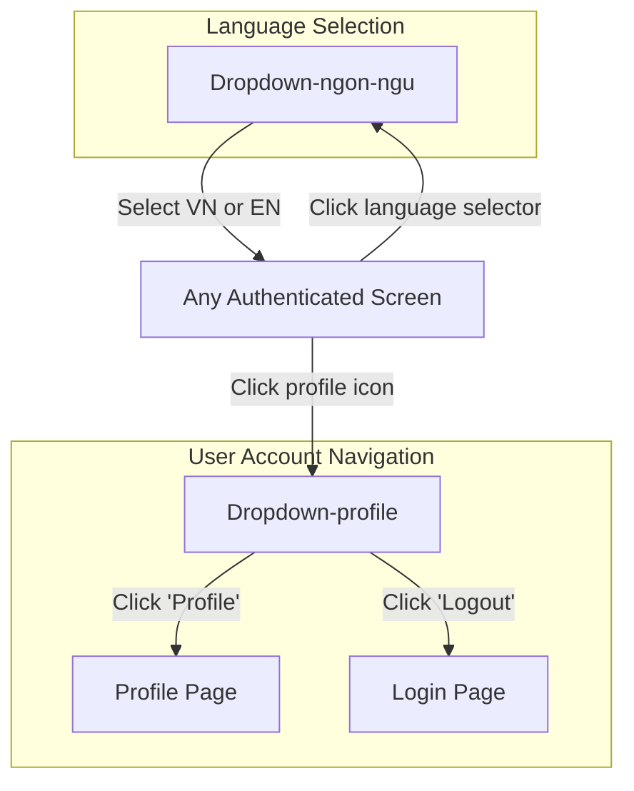
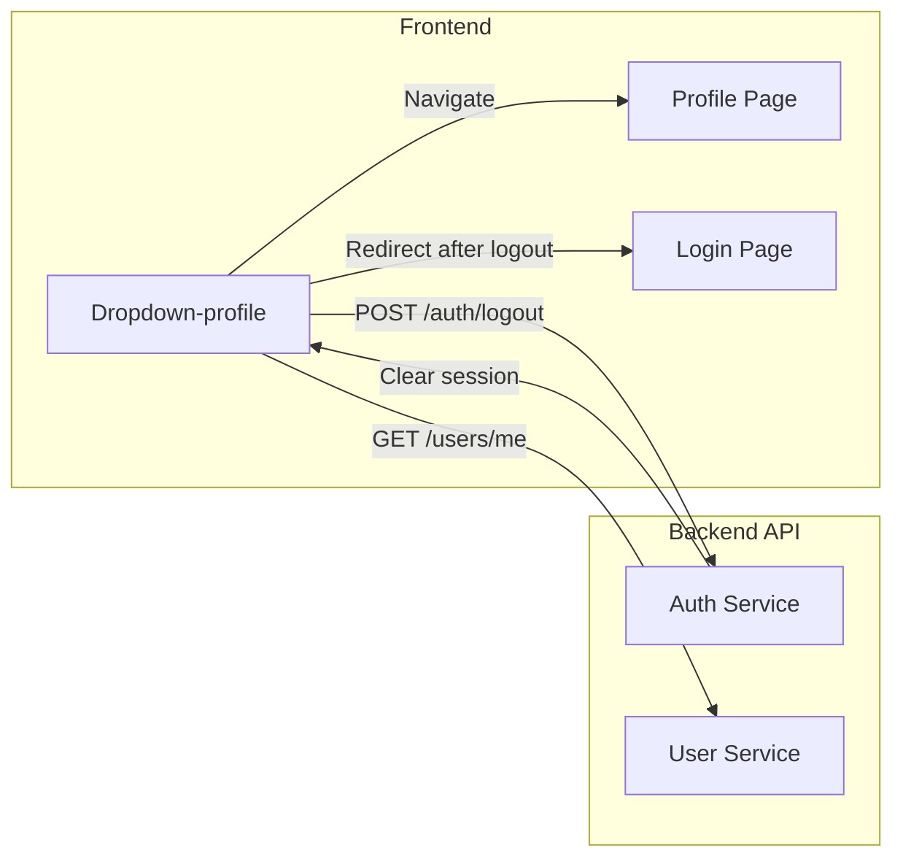

# Screen Flow Overview

## Project Info
- **Project Name**: SAA Application
- **Figma File Key**: 9ypp4enmFmdK3YAFJLIu6C
- **Figma URL**: https://www.figma.com/design/9ypp4enmFmdK3YAFJLIu6C
- **Created**: 2026-03-31
- **Last Updated**: 2026-03-31

---

## Discovery Progress

| Metric | Count |
|--------|-------|
| Total Screens | 2 |
| Discovered | 2 |
| Remaining | 0 |
| Completion | 100% |

---

## Screens

| # | Screen Name | Frame ID | Figma Link | Status | Detail File | Predicted APIs | Navigations To |
|---|-------------|----------|------------|--------|-------------|----------------|----------------|
| 1 | Dropdown-profile | 721:5223 | [Link](https://www.figma.com/design/9ypp4enmFmdK3YAFJLIu6C?node-id=721:5223) | discovered | [dropdown-profile.md](screen_specs/dropdown-profile.md) | GET /users/me, POST /auth/logout | Profile Page, Login Page (via Logout) |
| 2 | Dropdown-ngon-ngu | 721:4942 | [Link](https://www.figma.com/design/9ypp4enmFmdK3YAFJLIu6C?node-id=721:4942) | discovered | [dropdown-ngon-ngu.md](screen_specs/dropdown-ngon-ngu.md) | None (client-side) | N/A (closes dropdown, updates UI language) |

---

## Navigation Graph

---

## Screen Groups

### Group: Navigation / User Account
| Screen | Purpose | Entry Points |
|--------|---------|--------------|
| Dropdown-profile | User account dropdown with Profile and Logout actions | Click on profile icon/avatar from any authenticated screen |

### Group: Navigation / Localization
| Screen | Purpose | Entry Points |
|--------|---------|--------------|
| Dropdown-ngon-ngu | Language selector dropdown with VN and EN options | Click on language selector from any authenticated screen via the header |

---

## API Endpoints Summary

| Endpoint | Method | Screens Using | Purpose |
|----------|--------|---------------|---------|
| /users/me | GET | Dropdown-profile | Get current user info for display |
| /auth/logout | POST | Dropdown-profile | Invalidate session and clear tokens |

---

## Data Flow

---

## Technical Notes

### Authentication Flow
- JWT-based authentication
- Logout invalidates refresh token on server
- Token cleared from client storage on logout

### State Management
- Global state: Auth store (user, token, isAuthenticated)
- Dropdown open/close: Local component state

### Routing
- Profile: Navigate to /profile
- Logout: Redirect to /login after token cleanup
- Protected routes require authentication

---

## Discovery Log

| Date | Action | Screens | Notes |
|------|--------|---------|-------|
| 2026-03-31 | Initial discovery | Dropdown-profile | Dropdown with Profile and Logout menu items. Dark theme, glow effect on active item. |
| 2026-03-31 | Discovery | Dropdown-ngon-ngu | Language selector dropdown with VN and EN options. Client-side cookie-based, no API calls. |

---

## Next Steps

- [ ] Discover Profile page screen (target of Profile navigation)
- [ ] Discover Login page screen (target of Logout redirect)
- [ ] Verify navigation paths with actual frame IDs
- [ ] Map complete header/navbar component that contains this dropdown
